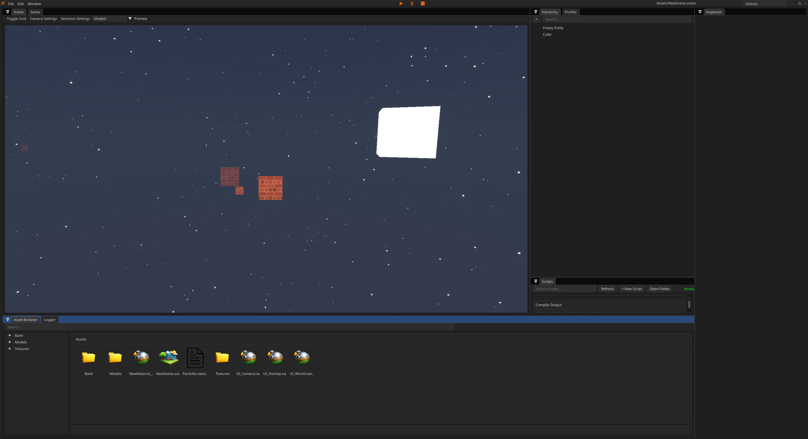

  

  <b>Computer Science @ Singapore Institute of Technology (DigiPen)</b> 
  Specializing in <b>real-time interactive simulation, graphics, and scalable systems</b>

---

<h2 align="center">💫 About Me</h2>

  💻 Systems-focused developer passionate about <b>performance-critical software</b> 
  ⚙️ Interested in <b>graphics engines, ML engineering, distributed systems, and trading tech</b> 
  🚀 Strong focus on <b>optimization, architecture, and low-level programming</b> 
  📈 Incoming intern at <b>Global Financial Markets Technology (DBS)</b> 
  🧠 Currently learning more about <b>GPU computing and AI systems</b>

---

<h2 align="center">🌐 Connect With Me</h2>

  &nbsp;
  &nbsp;
  

---

<h2 align="center">💻 Tech Stack</h2>

<h3 align="center">Languages</h3>

  
  
  
  
  

<h3 align="center">Systems, Graphics & ML</h3>

  
  
  
  

<h3 align="center">Tools & Platforms</h3>

  
  
  
  
  
  

<h3 align="center">IDEs</h3>

  
  
  

---

<h2 align="center">🚀 Featured Projects</h2>

<table align="center">
  <tr>
    <!-- Project 1 -->
    <td align="center" width="320" valign="top">
      
      </a>
        
      <b>Real-Time Simulation Engine</b>
       
      Custom real-time simulation and rendering engine for 3D interactive applications.
        
      <b>C++ • C# • OpenGL</b>
    </td>
    <!-- Project 2 -->
    <td align="center" width="320" valign="top">
      
      </a>
        
      <b>N.A.N.O: The Last Line</b>
       
      A single-player 2D platformer built using my custom real-time simulation engine, featuring gameplay systems, level interaction in a post-apocalyptic world.
        
      <b>C++ • ECS • OpenGL</b>
    </td>
    <!-- Project 3 -->
    <td align="center" width="320" valign="top">
      
        
      <b>Geo-Regulation Compliance System</b>
       
      AI-powered compliance platform with source-cited analysis and blockchain-backed audit verification.
        
      <b>Python • Streamlit • Gemini API • FAISS • Ethereum</b>
    </td>
  </tr>
</table>

---

<i>Always open to collaboration on interesting systems, graphics, or ML projects.</i>

